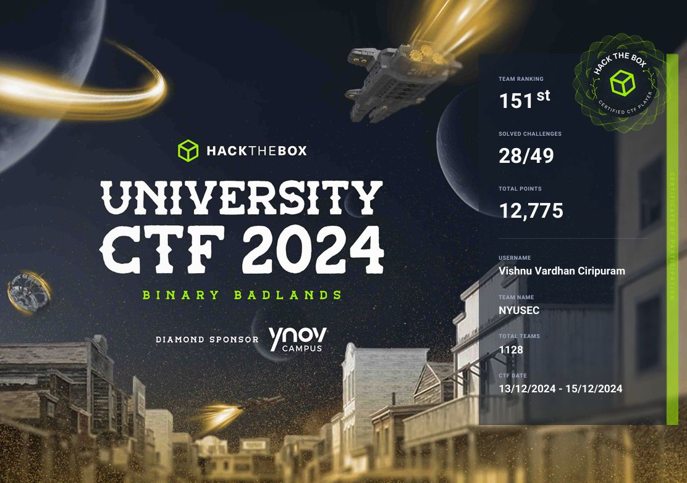

# HTB University CTF 2024 Write-Ups: Binary Badlands
This repository contains detailed write-ups for the HTB University CTF 2024 “Binary Badlands” event.  
Achieved **151st place** out of 1,128 teams by solving **28 challenges** across eight categories.

## Challenges Solved

- **Total challenges**: 28  
- **Team rank**: 151 / 1,128  
- **Categories**:
  - Blockchain
  - Coding
  - Crypto
  - Forensics
  - FullPwn
  - PWN
  - Reversing
  - Web

A consolidated PDF of all write-ups is available as:

